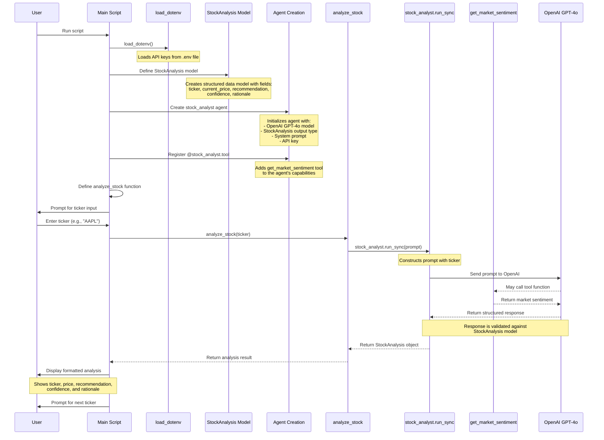

# PydanticAI Basic Example - Sequence Diagram

This diagram illustrates the sequence of function calls in the basic PydanticAI example (`pydantic_ai_basic.py`).

## Explanation of Key Components

1. **Environment Setup**:
   - `load_dotenv()` loads API keys from the `.env` file

2. **Model Definition**:
   - `StockAnalysis` Pydantic model defines the structure for stock analysis results

3. **Agent Creation**:
   - `stock_analyst = Agent(...)` creates an agent with:
     - LLM provider and model (`openai:gpt-4o`)
     - Output type (`StockAnalysis`)
     - System prompt (instructions for the agent)
     - API key from environment variables

4. **Tool Registration**:
   - `@stock_analyst.tool` decorator registers the `get_market_sentiment` function
   - This gives the agent the ability to retrieve market sentiment data

5. **User Interaction**:
   - Script prompts user for stock ticker input
   - User enters a ticker (e.g., "AAPL")

6. **Analysis Process**:
   - `analyze_stock(ticker)` function is called
   - This calls `stock_analyst.run_sync(prompt)` with the ticker
   - The agent sends the prompt to OpenAI's GPT-4o
   - The LLM may call the `get_market_sentiment` tool if needed
   - The LLM returns a response that's validated against the `StockAnalysis` model
   - The validated response is returned to the main script

7. **Result Display**:
   - Script displays the formatted analysis to the user
   - Process repeats for next ticker input
