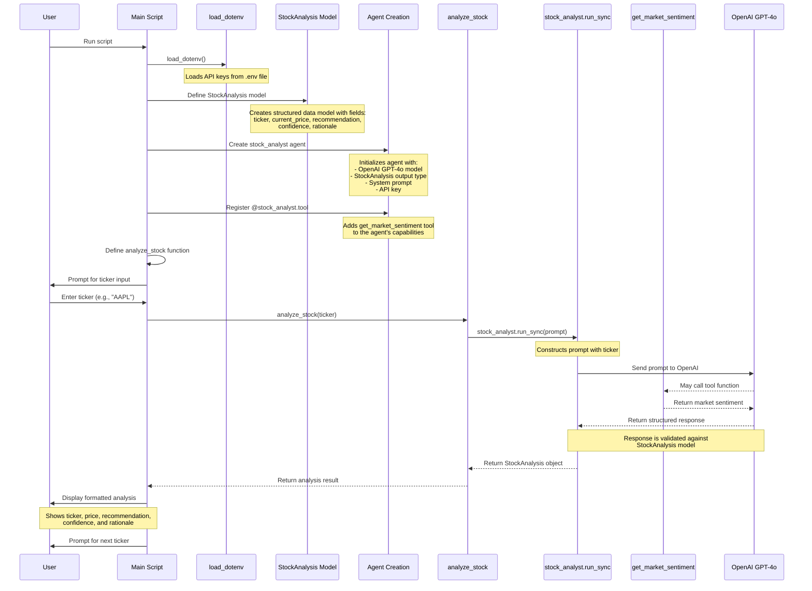
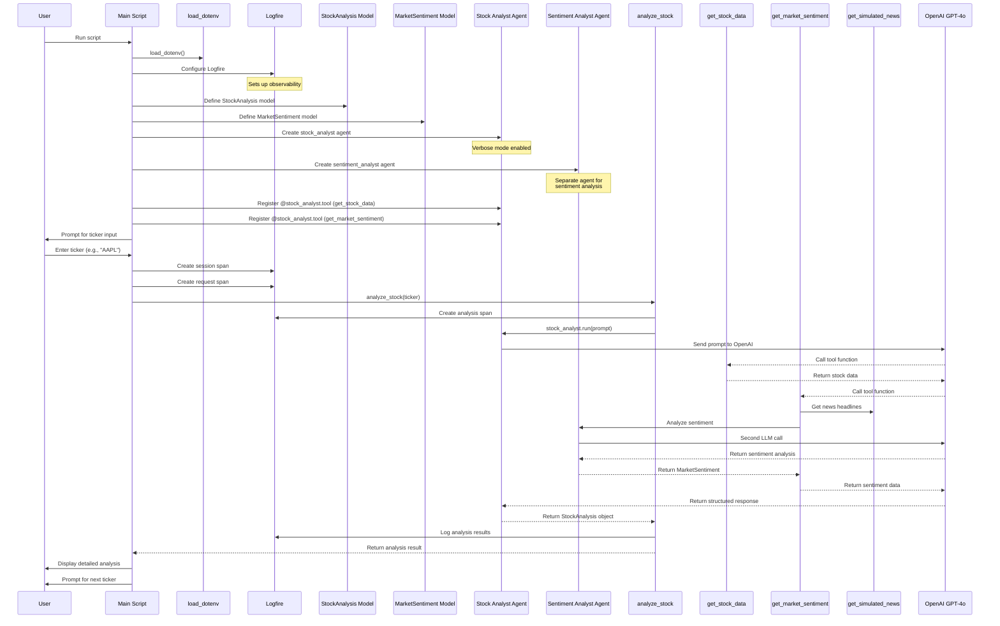
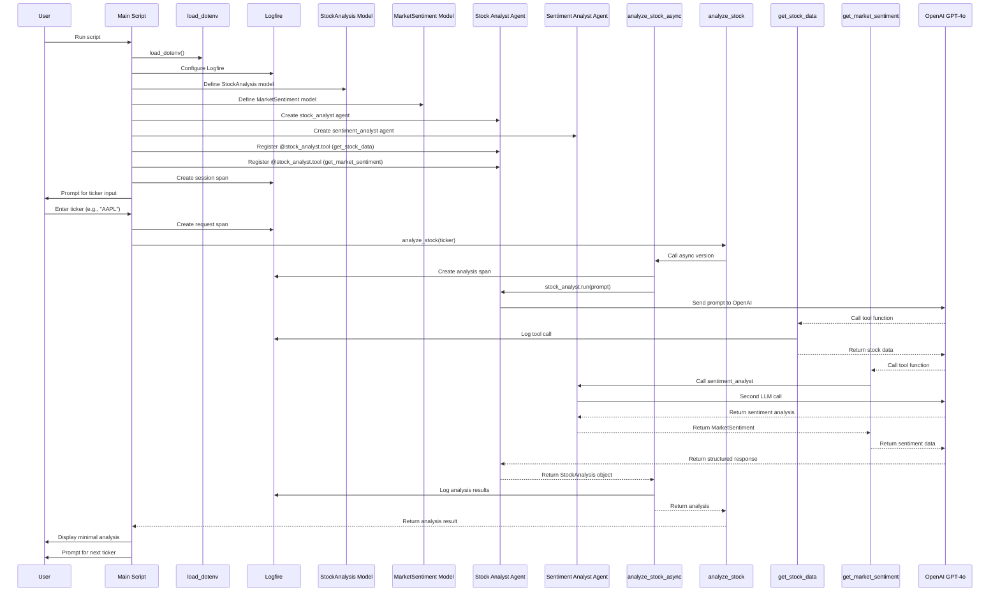
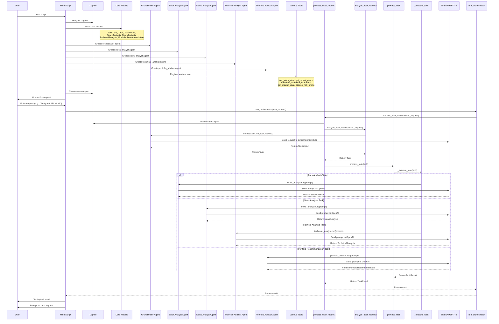

# PydanticAI Sequence Diagrams

This document contains sequence diagrams for all examples in the PydanticAI reference project, illustrating the flow of function calls and data in each implementation.

## Table of Contents

1. [Basic Example](#basic-example)
2. [Advanced Example](#advanced-example)
3. [Clean Example](#clean-example)
4. [Orchestrator Example](#orchestrator-example)

## Basic Example

This diagram illustrates the sequence of function calls in the basic PydanticAI example (`pydantic_ai_basic.py`).

### Key Components

1. **Environment Setup**: Loads API keys from the `.env` file
2. **Model Definition**: Defines the `StockAnalysis` Pydantic model for structured outputs
3. **Agent Creation**: Creates a stock analyst agent with GPT-4o
4. **Tool Registration**: Adds the `get_market_sentiment` tool
5. **User Interaction**: Processes user input (stock ticker)
6. **Analysis Process**: Sends prompt to LLM and validates response
7. **Result Display**: Shows formatted analysis to the user

## Advanced Example

This diagram illustrates the sequence of function calls in the advanced PydanticAI example (`pydantic_ai_advanced.py`), which adds multiple agents and more complex tools.

### Key Components

1. **Multiple Agents**: Uses separate agents for stock analysis and sentiment analysis
2. **Multiple Models**: Defines both `StockAnalysis` and `MarketSentiment` models
3. **Nested LLM Calls**: The sentiment analysis tool makes its own LLM call
4. **Observability**: Integrates Logfire for tracing and logging
5. **Verbose Output**: Provides detailed output with timing information

## Clean Example

This diagram illustrates the sequence of function calls in the clean PydanticAI example (`pydantic_ai_clean.py`), which focuses on code clarity with Logfire integration.

### Key Components

1. **Clean Code Design**: Focuses on readability and maintainability
2. **Comprehensive Logging**: Uses Logfire spans for detailed tracing
3. **Async/Sync Pattern**: Uses async functions internally with sync wrappers
4. **Error Handling**: Includes proper error handling and logging

## Orchestrator Example

This diagram illustrates the sequence of function calls in the orchestrator example (`pydantic_ai_orchestrator.py`), which demonstrates a multi-agent system with task routing.

### Key Components

1. **Multi-Agent System**: Uses multiple specialized agents for different tasks
2. **Task Routing**: Orchestrator agent determines which agent should handle each request
3. **Complex Data Models**: Defines multiple structured data models for different outputs
4. **Specialized Tools**: Each agent has access to specific tools for its domain
5. **Dynamic Task Execution**: Routes tasks based on their type to the appropriate agent
